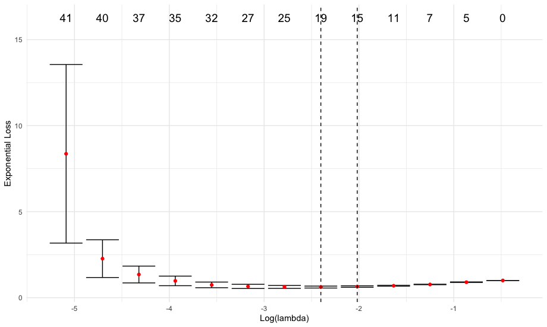

Introduction
============

The 'Regularized PAIrwise Ranking', or rpair, package is a convenient 
toolbox for conducting analyses on high-dimensional omics data. rpair combines
a general framework for casting complex outcomes into
pairwise learning problems with a penalty function allowing for sparse
solutions. This results in models that are not only able to fully
utilize such data, but are far more interpretable than traditional 
methods such as the Cox proportional hazard model. The package supports four
types of loss functions: logistic loss, exponential loss, squared hinge
loss and huberized hinge loss.
[JK: intro needs to be adapted, up to this point it could be glmnet. currently discussed in slack] 

Reference
=========

Buyukozkan, Chetnik, and Krumsiek. \"Regularized PAIrwise Ranking survival analysis:
RPAIR\". (unpublished) 2022

Installation instructions
=========================

The rpair package can be installed using the following command:

```r
require(devtools)
devtools::install_github(repo="krumsieklab/rpair", subdir="rpair")
```

Getting Started
===============
```r

# libraries
library(rpair)
library(magrittr)
library(survival)

# load example data
x <- rpair::ds1_x
y <- rpair::ds1_y

# run cross-validated rpair
set.seed(44)
cv = cv_rpair(x, y)

# lambda plot
plot(cv)

# apply model to input data
pr = predict(cv, x)
# show predicted survival times
pr[1:10]
```



    [1]  1.8386803 -2.7819668 -0.9915281 -1.2221169 -0.5459928  0.2180884 -0.6377641  2.6466038  1.8887652 -2.5777407


Tutorials
=========

Detailed examples illustrating the full functionality of the package
are provided in the following tutorials:

-   [Tutorial 1: the rpair function](https://github.com/krumsieklab/rpair/blob/master/tutorials/01_the_rpair_function.md)

-   [Tutorial 2: the cv_rpair function](https://github.com/krumsieklab/rpair/blob/master/tutorials/02_the_cv_rpair_function.md)

-   [Tutorial 3: analysis of dataset GSE3493NA ](https://github.com/krumsieklab/rpair/blob/master/tutorials/03_analysis_of_dataset_GSE37892.md)

-   [Tutorial 4: supported outcome types](https://github.com/krumsieklab/rpair/blob/master/tutorials/04_supported_outcome_types.md)