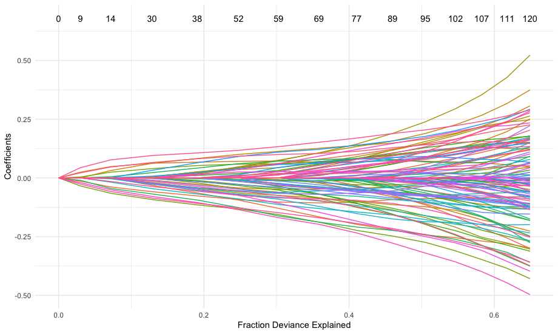

Tutorial 1: the rpair function
================

This tutorial demonstrates how to use the rpair function and its utility functions. The rpair function supports
four types of loss functions: exponential (default), logistic, squared hinge, and huberized hinge loss. Each loss type
is demonstrated below along with one or more of rpair's utility functions.

``` r
library(rpair)
library(magrittr)
library(survival)
```

## Generate Random Survival Dataset
```r
set.seed(41)
x = matrix(rnorm(40000),ncol = 200 )
S = Surv(cbind(sample(nrow(x)), rbinom(nrow(x),1,prob = 0.7)))

cp = rpair:::y_to_pairs.Surv(S)
```

```r
# first 4 rows and columns of the data matrix
x[1:4,1:4]
```
             [,1]       [,2]       [,3]        [,4]  
    [1,] -0.7943683 -0.7508653 -0.4146978  0.02697822  
    [2,]  0.1972575 -0.5664613 -0.3503992  2.62760469  
    [3,]  1.0017043  0.6997741  0.3240541 -0.99577921  
    [4,]  1.2888254 -0.6372901  0.1341382  0.39321401  

```r
# first five rows of survival data
colnames(S) <- c("time", "status")
S[1:5,]
```
         time status
    [1,]  180      0
    [2,]  185      1
    [3,]   44      1
    [4,]  149      1
    [5,]  174      1

```r
# first 10 rows of the comparable pairs
cp[1:5,]
```
         row col
    [1,]   7   2
    [2,]  23   2
    [3,]  31   2
    [4,]  38   2
    [5,]  41   2

## Exponential Loss
```r
efit = rpair(x, cp, loss_type="exp", pmax=50)
plot(efit)
```


```r
# extract coefficients from rpair object
ec <- coef(efit)
ec[12:16,11:15]
```
                 s10          s11          s12          s13         s14
    V12  .            .            .            .            .         
    V13  .            .            0.002650964  0.007841447  0.01256792
    V14  .           -0.003838902 -0.007691823 -0.011454027 -0.01485605
    V15  .            .            .            .            .         
    V16 -0.003320624 -0.007482734 -0.011241039 -0.014753196 -0.01829066

## Logistic Loss
```r
lfit = rpair(x, cp, loss_type="log", pmax=50)
plot(lfit, xvar="dev")
```



```r
# predict values from rpair object
lp <- predict(lfit, newx=x)
lp[1:4, 2:5]  # skip the intercept column
```
                   s1           s2           s3           s4
    [1,] -0.008572849 -0.016069312 -0.023236867 -0.030094521
    [2,]  0.017406220  0.033838006  0.049548946  0.064580900
    [3,]  0.001672157  0.002615468  0.003517347  0.004380103
    [4,]  0.019123444  0.037803408  0.055663949  0.072752749
    
## Squared Hinge Loss
```r
sfit = rpair(x, cp, loss_type="sqh",pmax=50)
plot(sfit, xvar="lambda")
```


```r
sn <- predict(sfit, type = "nonzero")
sn$s2
```
    [1] 36 57
```r
sn$s15
```
    [1]  13  14  16  30  31  36  41  57  92 118 127 141 143 169 174 178 188 195 196
## Huberized Hinge Loss
```r
hfit = rpair(x, cp, loss_type="huh",pmax=50)
plot(hfit, xvar="norm")
```


```r
hc <- predict(hfit, type="coefficient")
hc[12:16,12:16]
```

                 s11           s12          s13          s14         s15
    V12  0.000000000  0.0000000000  0.000000000  0.000000000  0.00000000
    V13  0.000000000  0.0007142186  0.005466097  0.009785006  0.01371642
    V14 -0.003424941 -0.0069906289 -0.010390398 -0.013452388 -0.01631686
    V15  .            .             .            .            .         
    V16 -0.006823550 -0.0103661137 -0.013461844 -0.016476534 -0.01915825
