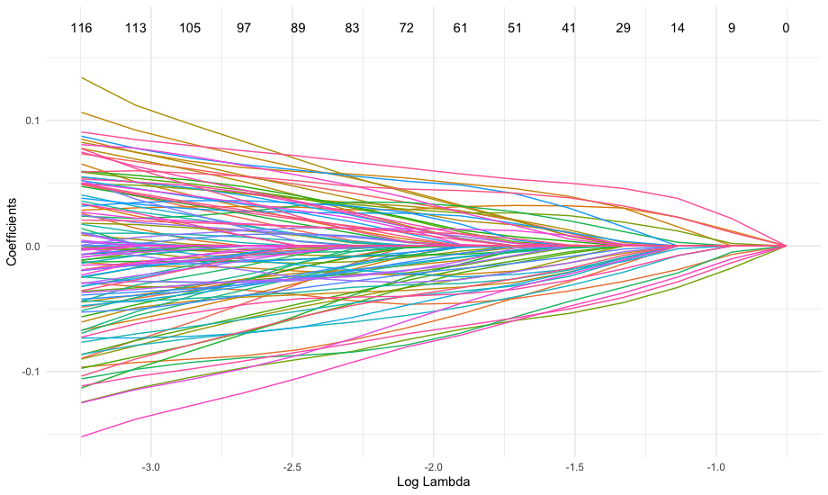

Tutorial 1: the rpair function
================

This tutorial demonstrates how to use the rpair function and its utility functions.  The rpair function supports four types of loss functions: exponential (default), logistic, squared hinge, and huberized hinge loss. Each loss type is demonstrated below along with one or more of rpair's utility functions.

NOTE: The rpair function performs model fitting on a dataset, however, in most cases it is desirable to optimize the models parameters using cross-validation. The cv_rpair function performs k-fold cross-validation for the rpair function. In most typical use cases, the user will call cv_rpair rather than call the rpair function directly.  The tutorial for the cv_rpair function can be found [here](https://github.com/krumsieklab/rpair/blob/master/tutorials/02_the_cv_rpair_function.md).


``` r
library(rpair)
library(magrittr)
library(survival)
```

## Generate Random Survival Dataset
```r
set.seed(41)
x = matrix(rnorm(40000),ncol = 200 )
S = Surv(sample(nrow(x)), rbinom(nrow(x),1,prob = 0.7))

cp = rpair:::y_to_pairs.Surv(S)
```

```r
# first four rows and columns of the data matrix
x[1:4,1:4]
```
             [,1]       [,2]       [,3]        [,4]  
    [1,] -0.7943683 -0.7508653 -0.4146978  0.02697822  
    [2,]  0.1972575 -0.5664613 -0.3503992  2.62760469  
    [3,]  1.0017043  0.6997741  0.3240541 -0.99577921  
    [4,]  1.2888254 -0.6372901  0.1341382  0.39321401  

```r
# first five rows of survival data
colnames(S) <- c("time", "status")
as.matrix(S)[1:5,] #[JK, isn't this a much nicer display? S[1:5]  ]
```
         time status
    [1,]   54      1
    [2,]   59      1
    [3,]   52      1
    [4,]  141      0
    [5,]  200      1

```r
# first five rows of the comparable pairs
cp[1:5,]
```
         row col
    [1,]   2   1
    [2,]   4   1
    [3,]   5   1
    [4,]   6   1
    [5,]   7   1


## Fit with exponential Loss
```r
efit = rpair(x, cp, loss_type="exp", pmax=50)
# generate trace plot
plot(efit)
```


```r
# extract coefficients from rpair object
ec <- coef(efit)
ec[22:24,16:21]
```
                s15         s16         s17          s18          s19          s20
    V22 -0.02246443 -0.02419861 -0.02594546 -0.027585749 -0.029432831 -0.031187990
    V23 -0.02425959 -0.02806981 -0.03173327 -0.035433977 -0.039239990 -0.042913564
    V24  .           .           .          -0.001695107 -0.003519271 -0.005579169


## Fit with logistic Loss
```r
lfit = rpair(x, cp, loss_type="log", pmax=50)
# generate trace plot
plot(lfit, xvar="dev")
```


```r
# predict values from rpair object
lp <- predict(lfit, newx=x)
lp[1:4, 2:5]  # skip the intercept column
```
                   s1            s2           s3          s4
    [1,] -0.003901896  0.0001017284  0.009983417  0.03207986
    [2,] -0.004849108 -0.0134936992 -0.031047703 -0.05235341
    [3,]  0.004310137 -0.0155949314 -0.036261348 -0.05663072
    [4,] -0.003066923 -0.0082080652 -0.016309725 -0.02769007
    
    
## Fit with squared Hinge Loss
```r
sfit = rpair(x, cp, loss_type="sqh",pmax=50)
plot(sfit, xvar="lambda")
```



```r
sn <- predict(sfit, type = "nonzero")
sn$s2 # [JK it seems like this fit is inspected different than the other two above and the fourth one below... why is that?]
```
    [1] 84  89  90  95 104 108 143
```r
sn$s15
```
    [1]   9  22  23  35  38  55  74  84  89  90  95  99 104 106 108 117 118 124 142 143 173 175 190 197 198  


## Huberized Hinge Loss
```r
hfit = rpair(x, cp, loss_type="huh",pmax=50)
plot(hfit, xvar="norm")
```


```r
hc <- predict(hfit, type="coefficient")
hc[21:23,16:20]
```

                s15         s16         s17         s18         s19
    V21  .           .           .           .           .         
    V22 -0.01727792 -0.01830283 -0.01922696 -0.02006928 -0.02093633
    V23 -0.01794908 -0.02064589 -0.02312661 -0.02555791 -0.02779619
