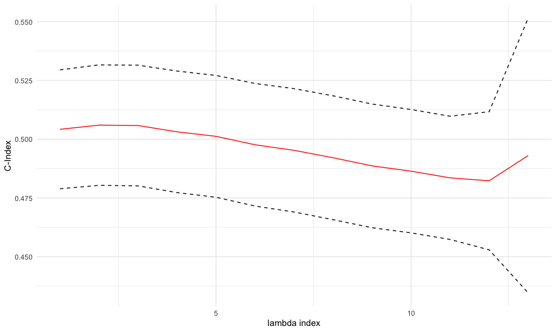

Tutorial 2: the cv_rpair function
================

This tutorial demonstrates how to use the cv_rpair function and its utility functions. The cv_rpair function performs
k-fold cross-validation of the rpair function. The cv_rpair functions supports two kinds of input: survival and continuous. Like rpair, cv_rpair has three corresponding utility functions: predict, coef, and plot. 
Two important parameters that are featured in this tutorial are type.measure and alignment. The type.measure parameter allows  the user to select which loss function to use for cross-validation - "deviance" (default) or "cindex". Selecting "deviance" uses the selected loss function itself (e.g. exponential loss) while selecting "cindex" uses an implementation of  
The alignment parameter determines whether to use the lambda values computed on the master fit to line up the data on each fold ("lambda", default) or if the predictions in each fold are aligned according to the fraction of progress along each fold ("fraction").

``` r
library(rpair)
library(magrittr)
library(survival)
```

## Generate Random Survival Dataset
```r
# number of samples
ks = 100

# number of features
n1 = 20 # n informative features
n2 = 40 # n noisy features

set.seed(42)

# coefficients
b = c( exp(runif(n1)), seq(n2)*0) %>% round(2)

x = matrix( rnorm((n1+n2)*100), nrow = ks ) %>% scale
S = Surv(exp( scale(x %*% b)), sample(c(F,T),ks, T) )
colnames(S) = c("time", "status")

fids = sample(4, ks, T)

alpha = 1
# the maximum number of variables ever to be nonzero
pmx = min(ncol(x), sum(S[,2]))
if(alpha < 0.5 ) pmx = ncol(x)+1


```

```r
# first 4 rows and columns of the data matrix
x[1:4,1:4]
```
               [,1]       [,2]        [,3]        [,4]
    [1,]  1.2613010  0.1289885 -1.29395115 -0.08864345
    [2,]  2.2108125  0.2711029  2.08074800 -0.84310551
    [3,] -1.3439050 -0.3622906  0.07022594 -1.14517033
    [4,] -0.2703135 -0.3823347 -0.12974566 -0.70252506 

```r
# first five rows of survival data
colnames(S) <- c("time", "status")
S[1:5,]
```
    [1] 0.2499683  7.2891822  2.3499586  1.6015316+ 1.2846922 

## type.measure = "deviance"
### alignment = "fraction"
```r
efit = cv_rpair(x, S, foldid=fids, nlambda=25, type.measure = "deviance", alpha = alpha,
                pmax = pmx, alignment = "fraction", keep = T, loss_type="exp")
plot(efit)
```


```r
epred = predict(efit, newx = xtr, s="lambda.min")
epred[1:5]
```
    [1]  2.0677687 -2.9669107 -1.0780859 -1.3149500 -0.5849274
    
```r
ec = coef(efit, s="lambda.1se")
ec[1:5]
```
    [1] -0.33103864 -0.09459406  0.00000000  0.00000000 -0.03626532

### alignment = "lambda"
```r
hfit = cv_rpair(x, S, loss_type="huh", foldid=fids, nlambda=25, type.measure = "deviance",
                pmax = pmx, alignment = "lambda", keep = T)
plot(hfit, ggplot=F)
```


```r
hpred = predict(hfit, xtr, s="lambda.1se")
hpred[1:5]
```
    [1]  0.4348660 -0.8906891 -0.3107375 -0.4157110 -0.1552527

```r
hc = coef(hfit, s="lambda.min")
hc[1:5]
```
    [1] -0.20607811 -0.11598244  0.00000000 -0.02551350 -0.06373397
## type.measure = "cindex"
### alignment = "fraction"
```r
sfit = cv_rpair(x, S, loss_type="sqh", nlambda=25, type.measure="cindex", alignment="fraction")
plot(sfit, ggplot=F)
```


```r
spred = predict(sfit, newx = xtr, s="lambda.1se")
spred[1:5]
```
    [1]  1.5582246 -1.8251346 -0.6313206 -0.8851065 -0.2853131
    
```r
sc = coef(sfit, s="lambda.min")
sc[1:5]
```
    [1] -0.35647908 -0.28158566 -0.09095634 -0.20593030 -0.20496220

### alignment = "lambda"
NOT WORKING - NEEDS TO BE FIXED
```r
lfit = cv_rpair(x, S, loss_type="log", nlambda=25, type.measure="cindex", alignment="lambda")
plot(lfit)
```


```r
lpred = predict(lfit, newx = xtr, s="lambda.min")
lpred[1:5]
```
    [1]  0.3277018 -1.1086094 -0.1631965 -0.3021159 -0.2706089
    
```r
lc = coef(lfit, s="lambda.1se")
lc[1:5]
```
    [1] -0.2961401  0.0000000  0.0000000  0.0000000  0.0000000
