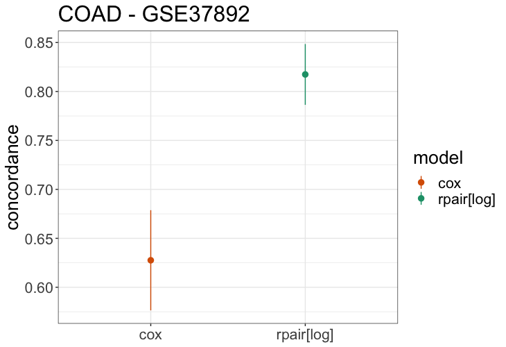

Tutorial 3: example analysis on transcriptomics dataset GSE37892
================

This tutorial demonstrates how to use rpair for performing a simple external analysis. The example analysis is performed using two public transcriptomics colorectal adenocarcinoma datasets from the mcsurvdata package: GSE39582 (model fitting) and GSE37892 (model evaluation).

``` r
library(rpair)
library(magrittr)
library(survival)
library(mcsurvdata)
```

## Download and Tidy Datasets
```r

eh <- ExperimentHub()
dat <- query(eh, "mcsurvdata")
nda.coad <- dat[["EH1498"]]

# survival outcome 
S =  Surv(nda.coad$tev+1, nda.coad$evn == 1)
nda.coad = nda.coad[,!is.na(S)] 

# gene expression data
mrna = Biobase::assayData(nda.coad)$exprs %>% t

# survival outcome 
S =  data.frame(t = nda.coad$tev+1, e = nda.coad$evn == 1)

# cohorts 
Z = paste0(nda.coad$dataset, nda.coad$cohort)

# split data to cohorts 
nods_coad <-
  lapply( structure( unique(Z), names = unique(Z) ), function(i){
    print(i)
    inds = (Z==i)
    x = as.matrix(scale(mrna[inds,]))
    y = Surv( S[inds,"t"], S[inds,"e"] )
    list(x=x, y=y)
  })
  

```

## Train on GSE39582
```r
# train data and outcome
x_tr = nods_coad$GSE39582$x
y_tr = nods_coad$GSE39582$y

# get stratified folds
set.seed(42)
fids = rpair:::get_stratified_folds(y_tr, 5)[,4]

# train model - THIS MAY TAKE 5-10 MINUTES
fit = cv_rpair(y = y_tr, x = x_tr, loss_type = "log", foldid=fids)

```

## Test on GSE37892
```r
# test data and outcome
x_te = nods_coad$GSE37892$x
y_te = nods_coad$GSE37892$y

# calculate concordance
log_conc = concordance(y_te~predict(fit, x_te, s = "lambda.min" ), reverse = T)

log_conc$concordance
```
0.8264816


## Comparison with glmnet
```r
# train glmnet cox model
fig = glmnet::cv.glmnet(x = x_tr, y = y_tr, family ='cox', pmax = sum(y_tr[,2]), foldid = fids)

# calculate concordance
cox_conc = concordance(y_te~predict(fig, x_te, s = "lambda.min" ), reverse = T)

cox_conc$concordance
```
0.6276028

```r
# assemble data
df <- data.frame("model" = c("rpair[log]", "cox"), 
            "cancer" = "COAD", 
            "concordance" = c(log_conc$concordance, cox_conc$concordance),
            "se"= c(sqrt(log_conc$var), sqrt(cox_conc$var)))

# plot comparison
ggplot(df, aes(x = model, y = concordance, color = model)) + 
  geom_pointrange(aes(ymin = concordance - se, ymax = concordance + se)) +
  geom_point(size = 2) + 
  theme_bw() + 
  scale_color_brewer(type = 'qual', palette = 2, direction = -1) +
  theme(axis.title.x = element_blank(), text = element_text(size = 20)) +
  ggtitle("COAD - GSE37892")
```

