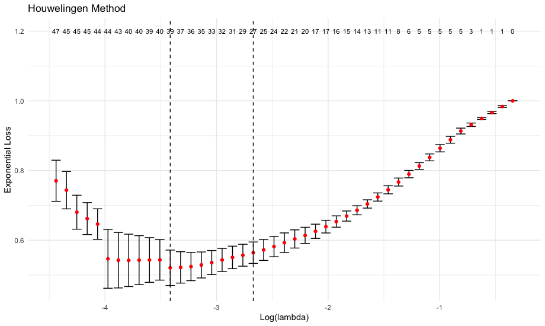
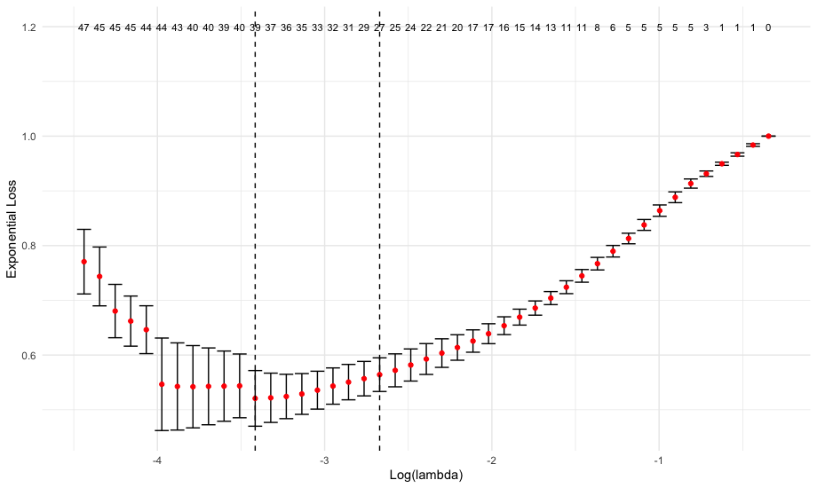
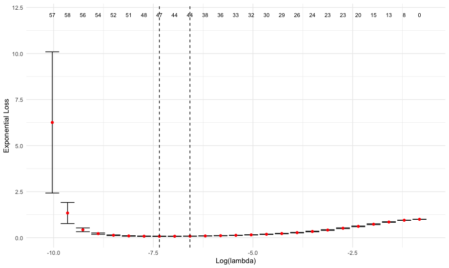
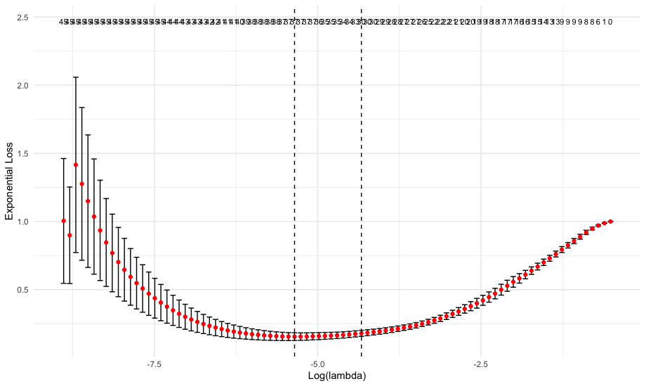

Tutorial 4: supported outcome types
================

This tutorial showcases each of the different types of outcome / response variables supported by the rpair package. These are: survival outcome (2 columns), survival outcome (3 columns), numeric outcome, ordinal outcome, factor outcome, and comparable pairs. For this example, we first create a single simulated dataset and a vector of coefficients. We modify this vector to generate the specific outcome types in each section.

``` r
library(rpair)
library(magrittr)
library(survival)
```

## Generate Random Data
```r
set.seed(73)

# generate survival data
ks = 100

# number of features
n1 = 20 # n informative features
n2 = 40 # n noisy features

# coefficients
b = c(exp(runif(n1)), seq(n2)*0) %>% round(2)

# generate data matrix
X = matrix(rnorm((n1+n2)*100), nrow = ks) %>% scale
```

## Survival outcome (2 columns)
```r
# generate two-column survival object
time = exp(scale(X %*% b))*10
status = sample(c(F,T),ks, T)
S = Surv(time, status )
colnames(S) = c("time", "status")

surv2_fit = cv_rpair(X, S, keep=T)

plot(surv2_fit)

coef(surv2_fit)[1:10]

predict(surv2_fit, X)[1:10]
```


[1]  0.000000000  0.000000000 -0.416909156 -0.028875330 -0.027832046 -0.003926241  0.000000000  0.000000000  0.000000000
[10] -0.162762181

[1] -0.29008766  0.25287715 -0.96421248  0.01087717  1.00497513  0.22422217 -0.12566252  0.51716887  1.29352701  0.63336672

## Survival outcome (3 columns e.g. count type Surv object)
```r
# generate three-column surival object
S = Surv(rep(0, ks), time, status)
colnames(S) = c("start", "stop", "status")

surv3_fit = cv_rpair(X, S, foldid = surv2_fit$foldid, keep=TRUE)

plot(surv3_fit)

coef(surv3_fit)[1:10]

predict(surv3_fit, X)[1:10]
```


[1]  0.000000000  0.000000000 -0.416909156 -0.028875330 -0.027832046 -0.003926241  0.000000000  0.000000000  0.000000000
[10] -0.162762181

[1] -0.29008766  0.25287715 -0.96421248  0.01087717  1.00497513  0.22422217 -0.12566252  0.51716887  1.29352701  0.63336672

## Numeric outcome
```r
# numeric outcome here is equal to time and stop in the two survival outcome examples above
y = time

num_fit = cv_rpair(X, y, foldid=surv2_fit$foldid, nlambda=25)

plot(num_fit)

coef(num_fit)[1:10]

predict(num_fit, X)[1:10]
```


[1] -1.674607 -1.218404 -2.097692 -1.965485 -1.928591 -1.317522 -1.708885 -2.926697 -1.394793 -2.422563

[1]   7.058464   6.354989 -11.440731   3.716204  10.286766   8.770705   2.005260  -4.488992   4.940699  10.794521

## Ordinal outcome
```r
# create ordinal outcome 
y = scale(X %*% b)
y = (y - min(y) + 10)^2
# number of levels for ordinal outcome
l = 4
# ordinal levels
y = cut(y, breaks = seq(min(y), max(y), length.out = l+1), include.lowest = T) %>% as.numeric

set.seed(83)
ord_fit = cv_rpair(X, y)

plot(ord_fit)

coef(ord_fit)[1:10]

predict(ord_fit, X)[1:10]
```


 [1] -0.3616616 -0.1783177 -0.7564347 -0.0380190 -0.4641262 -0.2326062 -0.5512703 -0.7515915 -0.1125388 -0.4808555

 [1]  1.5716478  0.7575398 -4.0969970  0.1345124  3.2670136  2.3741983 -1.3744034  0.2319598  1.5260469  3.0654708

# @Mustafa - Not sure this makes sense when evaluating loss
## Comparable pairs
Users can also provide comparable pairs as direct input to the cv_rpair (and rpair) function(s). The following
example takes the 2-column survival outcome produced in the first example and uses the internal rpair function to
generate comparable pairs. It then runs cv_rpair using the comparable pairs as the 

IMPORTANT NOTE: The function cv_rpair does not support the use of comparable pairs without user-provided folds. This is because important information for generating stratified folds (for example, in the case of comparable pairs generated from survival data) can be lost when providing only the pairs.

IMPORTANT NOTE: When comparable pairs are used as the outcome,

```r
# generate survival times
S = Surv(S[,2], S[,3])
colnames(S) = c("time", "status")

# generate comparable pairs from 2-column survival data
cp = rpair:::y_to_pairs(S)

# get fold ids
set.seed(25)
fids = rpair:::get_stratified_folds(S, nfolds=5)

# fit model
cp_fit = cv_rpair(X, cp, foldid=surv2_fit$foldid, pmax=48, keep=TRUE)

# get log lambda plot and beta coefficients
plot(cp_fit)

coef(cp_fit)

predict(cp_fit, X)
```
